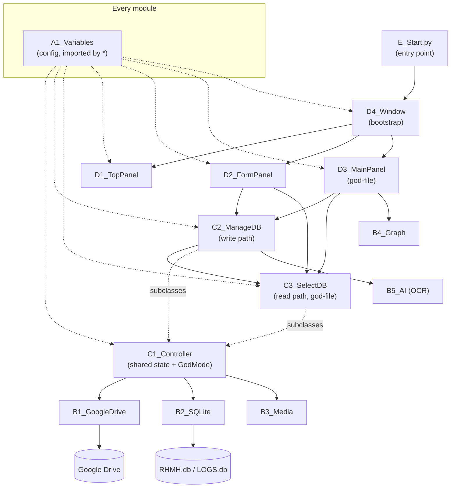

# REWORK-BRIEF — RHMH as it exists today

This document is the distilled understanding produced by the 2026-08-02
MD-First 2.0 documentation session — the owner's stated goal was to
"understand all functionalities" of this old, previously-undocumented app
before a future full rework. It is a functional map of the ENTIRE
application: every feature, which module owns it, the architectural
problems observed while reading every one of the 24 source files, the
reconstructed database schema, the external touchpoints, and a list of
findings that need the owner's decision before the rework starts.

**How to use this document:** read it top to bottom once, then use it as an
index back into the per-file `__about/`/`__flow/` docs (linked throughout)
when you need the exact method-level detail. Every claim here was verified
against the current code, not copied from a prior description — this
project had zero documentation before this session.

## Table of Contents

- [Feature Inventory](#feature-inventory)
- [Architecture Map](#architecture-map)
- [Vendored & Patched Third-Party Code](#vendored)
- [Orphaned & Duplicate Files](#orphaned)
- [God-Files & Structural Debt](#god-files)
- [Config Centralization Candidates](#config-centralization)
- [Security Observations](#security)
- [Database Schema Summary](#db-schema)
- [External Dependencies & Data Touchpoints](#external-deps)
- [Cross-Cutting Duplication](#duplication)
- [Testing Baseline](#testing-baseline)
- [Open Questions](#open-questions)

---

## Feature Inventory

### Patient Records

CRUD on the core `pacijent` table plus its linked `dijagnoza` (diagnoses)
and `operacija` (staff assignments) tables. Entry form:
[D2 Form Panel](__about/D2_FormPanel.md) (two swappable sub-forms, driven
by the `form_entry` config table). List/search/filter:
[D3 Main Panel](__about/D3_MainPanel.md)'s Pacijenti tab +
[C3 Select DB](__about/C3_SelectDB.md)'s search-bar/table-fill machinery.
Create/Update/Delete: [C2 Manage DB](__about/C2_ManageDB.md)'s
`Add_Patient`/`Update_Patient`/`Delete_Patient` (the latter's diff-based
Update is the most complex single method in the write path).

### Medical Imaging

Patient-linked images/videos stored as BLOBs in `slike`, synced to Google
Drive. Upload/edit/delete: [C2 Manage DB](__about/C2_ManageDB.md)'s
`Add_Image`/`Edit_Image`/`Delete_Image`. Viewing: the zoomable/pannable
canvas viewer and video-thumbnail generation in
[B3 Media](__about/B3_Media.md), orchestrated by
[C3 Select DB](__about/C3_SelectDB.md)'s `Show_Image*` methods and
displayed in [D3 Main Panel](__about/D3_MainPanel.md)'s Slike tab (and a
mini-table inside the patient form itself,
[D2 Form Panel](__about/D2_FormPanel.md)).

### MKB-10 Diagnosis Catalog

A lookup/CRUD catalog of MKB-10 diagnosis codes (`mkb10`, grouped by
`kategorija`). Browsing + quick-append into the patient form:
[C3 Select DB](__about/C3_SelectDB.md)'s `fill_MKBForm`/`MKB_double_click`.
CRUD: [C2 Manage DB](__about/C2_ManageDB.md)'s `Add_MKB`/`Update_MKB`/
`Delete_MKB`. UI: [D3 Main Panel](__about/D3_MainPanel.md)'s Katalog tab.

### Staff / Personnel Management

A similar catalog for staff (`zaposleni`, grouped by `funkcija` — role),
used both as its own catalog tab and as the source for the patient form's
Operator/Asistent/Anesteziolog/Anestetičar/Instrumentarka/Gostujući
Specijalizant fields. Same module split as MKB-10 (C2 write, C3 read,
D3 UI).

### Operational Analytics / Charts

A configuration wizard (Y metric × up to two X grouping dimensions —
category, staff role, age bracket, or date bucket) that builds one
aggregate SQL query and renders it as a bar/pie/stacked-bar matplotlib
chart. Query building + rendering + settings dialog all live in
[B4 Graph](__about/B4_Graph.md) (three responsibilities in one class — see
[God-Files](#god-files)); the wizard's cascading-combobox UI lives in
[C3 Select DB](__about/C3_SelectDB.md) (see its
[flow doc](__flow/C3_SelectDB.md) for the state machine); the tab shell is
in [D3 Main Panel](__about/D3_MainPanel.md).

### AI-Assisted OCR ("Fill Form From Image")

Reads a scanned "Operaciona Lista" (surgery record) form via EasyOCR and
rule-based-parses operation date, MKB codes, and doctor names by role,
auto-filling the patient form. Pipeline: [B5 AI](__about/B5_AI.md). Only
line-mode parsing is implemented; paragraph mode is a stub. Orchestration
(download the image, open settings, spawn the reader thread, apply the
result to form widgets): [C2 Manage DB](__about/C2_ManageDB.md)'s
`Fill_FromImage`/`Image_Read`.

### Google Drive Backup & Sync

OAuth + upload/download/rename/delete/permission wrapper:
[B1 Google Drive](__about/B1_GoogleDrive.md). Drive is the source of truth
for `RHMH.db`/`Default.json`/per-user log databases; the app falls back to
the local SQLite copy when offline (`Controller.Connected` gates every
write path via `block_manageDB()`). Startup connect flow, settings
persistence, and the offline reconnect button: split between
[C1 Controller](__about/C1_Controller.md) and
[D1 Top Panel](__about/D1_TopPanel.md).

### GodMode / Hidden Admin

A hidden, hardcoded-password-gated unlock (`GodMode` in
[C1 Controller](__about/C1_Controller.md)) that reveals the Logs/Session
tabs ("Admin" tier) and adds a raw-SQL console + a "merge every user's
remote log DB" maintenance tool ("God Mode" tier). Activated via a secret
Tk key-sequence bound in [D4 Window](__about/D4_Window.md). This is the
closest thing the app has to a role system — there is no user/role table
anywhere in the reconstructed schema. See [Security](#security).

### Session & Audit Logging

Every decorated method's exceptions and every DB mutation get written to
the `LOGS` database (`logs`, `session` tables) via
[A2 Decorators](__about/A2_Decorators.md)' `error_catcher` and
[C1 Controller](__about/C1_Controller.md)'s `LoggingData`/
`Upload_local_LOGS`. Per-session telemetry (a pickled snapshot of
`UserSession`) is viewable, paginated, in
[D3 Main Panel](__about/D3_MainPanel.md)'s Session tab via
[C3 Select DB](__about/C3_SelectDB.md)'s `Dict_To_String` report formatter.

### Theming & Settings

7 custom ttkbootstrap color themes (patched into the installed
`ttkbootstrap` package — see [Vendored Code](#vendored)) plus a Settings
tab covering theme/title-image choice, default visible columns, language,
font, window size, and cooldown timers, all persisted to `Settings.json`.
UI: [D3 Main Panel](__about/D3_MainPanel.md)'s Settings tab. Persistence:
[C1 Controller](__about/C1_Controller.md)'s `update_settings`/
`restore_default_settings`.

---

## Architecture Map

**Dependency direction inside the controller layer**: `C1_Controller` is
the base; `C2_ManageDB` and `C3_SelectDB` both subclass it; `C2 → C3`
(ManageDB calls SelectDB's `refresh_tables`/`fill_PatientForm`/
`Show_Image_FullScreen`) but `C3` never imports `C2`. Any future split of
either file must preserve this one-directional call graph.

**Shared-mutable-state pattern**: nearly every class in the app
(`GoogleDrive`, `Media`, `Graph`, `AI`, `Controller` itself) stores its
"instance" state on class attributes rather than `self` — there is
effectively one GoogleDrive session, one media viewer, one chart, one OCR
reader, and one `Controller` app-wide, not one per window/tab. This is
consistent throughout the codebase, not a one-off mistake, and any rework
that wants real multi-window or multi-session support will need to
decide this deliberately rather than inherit it by accident.

---

## Vendored & Patched Third-Party Code

The single biggest architectural surprise found in this session:
**`fixing_modules/` does not hold original RHMH application code.** Every
one of its 7 files is a vendored copy of a third-party library's own
internals — `ttkbootstrap` (`widgets.py`, `dialogs.py`, `scrolled.py`,
`window.py`, `user.py`), `customtkinter` (`scaling_base_class.py`), and
`torch` (`_ufuncs.py`) — and **none of them are imported by any of the 17
root-level project files** (verified by grepping every root file for every
possible import spelling).

Two files are proven to matter, but not through Python's import system:

- **`widgets.py`** carries a genuine, hand-written patch (6 lines marked
  `# dodato`, Serbian "added") that gives `ttkbootstrap.Meter` a
  configurable minimum value (`amountmin`) instead of always starting at 0.
- **`user.py`** carries the app's 7 custom color themes (`USER_THEMES`).

Both patches were verified, byte-for-byte, to also be present in this
development machine's **installed** `site-packages/ttkbootstrap/`
package. That is the mechanism: the owner edits the copy in
`fixing_modules/`, then manually applies the same edit to the installed
package, because `ttkbootstrap.Meter`/the theme registry are only ever
imported normally (`import ttkbootstrap as tb` in
[A1 Variables](__about/A1_Variables.md)) — never from `fixing_modules/`.
**This means the patch is currently invisible to any dependency
manifest and would be silently lost the moment `pip install --upgrade
ttkbootstrap` or a fresh `pip install -r requirements.txt` runs on a new
machine** — there is no `requirements.txt` in this repo today either (see
[Open Questions](#open-questions)).

The other five files show no comparable purpose:

- `dialogs.py` and `window.py` are unmodified vendor copies (the app
  imports the real `ttkbootstrap.dialogs.dialogs`/`ttkbootstrap.window`
  directly).
- `scrolled.py` is likewise unmodified (the app imports the real
  `ttkbootstrap.scrolled` directly).
- `scaling_base_class.py` is **byte-identical** to the installed
  `customtkinter` package's file — zero diff, zero patch, and its own
  relative imports (`.scaling_tracker`, `..font`) don't even resolve from
  this location.
- `_ufuncs.py` is PyTorch's own numpy-compatibility internals — entirely
  unrelated to a Tkinter medical-records app, with unresolvable relative
  imports of its own. This is the strongest candidate for an accidental
  copy-paste artifact in the whole codebase.

**Rework recommendation:** decide, file by file, whether to (a) delete the
five inert copies outright (the app already works without them — nothing
imports them), (b) extract just the `Meter.amountmin` and `user.py` theme
patches into a small, clearly-labeled patch module or a `pip`-installable
fork, and (c) add a `requirements.txt`/lockfile that pins the exact
`ttkbootstrap` version the patches were written against, so the patch
isn't silently lost on a fresh environment. None of this was changed in
this session (Guideline #3 — ask before deleting); see
[Open Questions](#open-questions).

Per-file detail: [fixing_modules (folder)](fixing_modules/___fixing_modules.md).

---

## Orphaned & Duplicate Files

- **`A3_LoadSplash.py`** — a complete, standalone `Loading_Splash` class,
  never imported anywhere. [B3 Media](__about/B3_Media.md) defines a
  near-identical, slightly more integrated version of the same class,
  which IS what `E_Start.py` actually uses. Likely an earlier iteration
  left in place. See [about](__about/A3_LoadSplash.md).
- **Unused imports**: `B4_Graph.py` and `B5_AI.py` both
  `from B3_Media import Media` with no call site found in either file
  during this review; `D4_Window.py` imports `GoogleDrive` from
  [B1 Google Drive](__about/B1_GoogleDrive.md) with no reference in its
  body. Flagged, not removed — a repo-wide grep (not just the reviewed
  file) should confirm before deleting an import (see
  [Open Questions](#open-questions)).
- **`fixing_modules/user.py`'s name is misleading** — it holds theme color
  data, not user/role/authentication logic. If real user/role logic exists
  anywhere in this codebase, this session did not find it; `GodMode`
  (hardcoded passwords) is the closest equivalent. See
  [Security](#security).
- **`test.py`** is not a pytest test despite its name — it is a manual,
  unguarded DB-wipe-and-vacuum maintenance script. See
  [about](__about/test.md). Consider renaming in the rework to avoid
  confusion with the new `tests/` guard suite.

---

## God-Files & Structural Debt

Four files exceed the 1,000-line Structure Law threshold and are ratcheted
in `tests/test_structure_law.py` under the owner's pre-authorized reason
("awaiting the REWORK — splitting before it wastes the effort"):

| File | Lines | Why it's oversized |
|------|-------|---------------------|
| `fixing_modules/dialogs.py` | 1,881 | Vendored `ttkbootstrap` dialog library — not RHMH's own sprawl (see [Vendored Code](#vendored)); the fix is likely deletion, not a split. |
| `C3_SelectDB.py` | 1,257 | Genuine RHMH sprawl — at least 4 independent domains (table/search plumbing, Graph wizard, image/video viewer, session-report engine). See [about](__about/C3_SelectDB.md) for the full responsibility table. |
| `fixing_modules/widgets.py` | 1,175 | Vendored `ttkbootstrap` widget library carrying one real 6-line patch — the fix is extracting the patch, not splitting the vendored bulk. |
| `D3_MainPanel.py` | 1,045 | Genuine RHMH sprawl — 8 independent tab-building responsibilities in one class. See [about](__about/D3_MainPanel.md) for the per-tab line breakdown. |

**One file is a smell, not a violation**: `C2_ManageDB.py` (804 lines) — 5
largely independent responsibilities (export, bulk download, CRUD×4 entity
types, OCR autofill orchestration, field validation) in one class, but
under the 1,000-line guard threshold. Worth the same "does this file hold
more than one responsibility" question in the rework even though the guard
doesn't force it today.

**Repeated design smells found across the god-files and beyond** (not
file-specific — a rework-wide pattern):
- Every write-path method (`ManageDB`) and every read-path method
  (`SelectDB`) reads/writes `Controller.*` class attributes directly
  instead of taking/returning parameters — nothing here is unit-testable
  without a live GUI instance.
- Near-identical Treeview+scrollbar+bind boilerplate is repeated by hand
  for each of the 6 data tabs, instead of one config-table-driven
  generator.
- `Add_MKB`/`Update_MKB`/`Delete_MKB` vs. `Add_Zaposleni`/
  `Update_Zaposleni`/`Delete_Zaposleni` are near-identical bodies
  parameterized only by table/column names.

---

## Config Centralization Candidates

[A1 Variables](__about/A1_Variables.md) is the intended single config
home, but real config-like tables have accumulated elsewhere, nested
inside class bodies or function scope (outside what the automated Config
Section Law guard can check — see
[tests/test_config_sections.py](tests/test_config_sections.py)'s
`CONFIG_FILES` comment):

| Table | Lives in | What it configures |
|-------|----------|---------------------|
| `Y_options`, `X_options`, `DateTypes`, `SQL_date_num` | `B4_Graph.Graph` (class attrs) | Analytics axis choices → SQL fragments |
| `DoctorsImage_dict` | `B5_AI.AI.Operaciona_LineReader` (function-local) | The OCR form's doctor-role prefixes — domain knowledge about one physical paper form |
| `form_buttons`, `form_groups`, `form_entry` | `D2_FormPanel.FormPanel` (class attrs) | The entire patient-form field layout |
| `SYSTEM`, `Values`, `TEXT` | `D3_MainPanel` (function-local, inside `SettingsTab_Create`/`AboutTab_Create`) | Settings-tab numeric ranges, font/language lists, About-tab credits |
| 3 hardcoded GodMode passwords | `C1_Controller.GodMode` | Access control — see [Security](#security) |

---

## Security Observations

Documented as findings, not fixed (zero-behavior-change scope). Ranked by
severity for the rework:

1. **`GodMode.FreeQuery_Execute`** ([C1 Controller](__about/C1_Controller.md))
   executes an arbitrary, user-typed, unparameterized raw SQL string
   against `RHMH.db` or `LOGS.db`. Gated only by a hardcoded password, no
   injection guard, no undo. Highest-risk item in the codebase.
2. **Hardcoded plaintext passwords** compared by equality
   (`GodMode.GodMode_Password`) — no role table, no hashing, no per-user
   accountability beyond whatever email happens to be logged in
   `UserSession`.
3. **A secret Tk key-sequence** (`D4_Window.py`, spelling `MUV13` via
   Unicode escapes) is the only gate on reaching the password prompt at
   all — obfuscated, not secured.
4. **Inconsistent SQL parameterization**: `execute_Update`/`execute_Insert`
   in [B2 SQLite](__about/B2_SQLite.md) use `?` binding; `execute_Delete`,
   `execute_join_select`, `get_patient_data`, every `get_distinct_*`
   helper, and [B4 Graph](__about/B4_Graph.md)'s `Graph_makeQuery` all
   interpolate values via f-strings. Values are mostly internally sourced
   (UI selections, cached IDs) rather than raw free text, but the
   inconsistency itself is a maintenance hazard.
5. **Credential files** (`www_credentials.json`, `www_token.pickle`) are
   correctly gitignored; this documentation session confirmed their key
   *names* only, never their contents, and reproduces neither here nor
   anywhere else in the docs tree.

---

## Database Schema Summary

**No `CREATE TABLE` statement exists anywhere in the 24 files reviewed.**
[B2 SQLite](__about/B2_SQLite.md) introspects the schema at runtime via
`PRAGMA table_info(...)`. The table/column map below is reconstructed from
every query that names a column, across `B2_SQLite.py`, `C1_Controller.py`,
`C2_ManageDB.py`, `C3_SelectDB.py`, and `B4_Graph.py` — it is a **best
inference, not authoritative DDL**. Locating the actual schema-creation
source (a setup script, a migration, or the live `.db` file's own
`sqlite_master`) is the first thing the rework session should do; see
[Open Questions](#open-questions).

| Table | Columns referenced in code | Role |
|-------|------------------------------|------|
| `pacijent` | `id_pacijent`, `Ime`, `Prezime`, `Pol`, `Starost`, `Godište`, `Datum Prijema`, `Datum Operacije`, `Datum Otpusta`, + more via `MainTablePacijenti` | Core patient record |
| `dijagnoza` | `id_pacijent`, `id_dijagnoza`, `id_kategorija` | Join: patient ↔ MKB-10 diagnosis |
| `mkb10` | `id_dijagnoza`, `` `MKB - šifra` ``, `Opis Dijagnoze` | MKB-10 catalog |
| `kategorija` | `id_kategorija`, `Kategorija` | Diagnosis category lookup |
| `operacija` | `id_pacijent`, `id_zaposleni`, `id_funkcija` | Join: patient ↔ staff assignment |
| `zaposleni` | `id_zaposleni`, `Zaposleni` | Staff catalog |
| `funkcija` | `id_funkcija`, `Funkcija` | Staff role lookup |
| `slike` | `id_slike`, `id_pacijent`, `Naziv`, `Opis`, `Format`, `Veličina`, `width`, `height`, `blob_data` (last column) | Patient-linked images/videos, BLOB storage |
| `logs` | `ID Time`, `Email`, `Query`, `Full Query`, `Error`, `Full Error` | Audit trail (`LOGS.db`) |
| `session` | `Email`, `Logged IN`, `Logged OUT`, `Session` (pickled telemetry blob) | Session history (`LOGS.db`) |

Two physical database files: `RHMH.db` (patient/clinical data — the first
8 tables above) and `LOGS.db` (`logs`/`session`, mirrored on Drive as
`GD_LOGS.db` for cross-user merge via `GodMode.JoiningLogs`).

---

## External Dependencies & Data Touchpoints

- **Google Drive API v3** — OAuth scopes: `drive`, `drive.file`,
  `admin.directory.user`, `userinfo.email`, `openid`
  ([B1 Google Drive](__about/B1_GoogleDrive.md)). Credential files, by
  name only (gitignored, never reproduced): `www_credentials.json` (OAuth
  client secret), `www_token.pickle` (cached user token).
- **Drive object IDs** (not secrets — object references) live in
  [A1 Variables](__about/A1_Variables.md): `RHMH_dict`, `LOGS_dict`,
  `GD_LOGS_dict`, `DEFAULT_dict`, `GD_SLIKE`, `GD_MAIN`, `GD_LOGS`.
- **Local files**: `RHMH.db`, `LOGS.db`, `GD_LOGS.db` (SQLite),
  `Settings.json` (live config, loaded once at import time — a change
  needs an app restart), `Default.json` (factory-reset settings, itself
  synced from Drive), `temporary/temp_image.png`/`temp_video.mp4` (fixed
  scratch paths, overwritten on every image/video open, no cleanup).
- **No `requirements.txt` or lockfile** exists in this repo — the Tech
  Stack list in [README.md](README.md) is the only record of dependencies;
  see [Open Questions](#open-questions) re: pinning the `ttkbootstrap`
  version the vendored patches were written against.
- **EasyOCR model cache** — managed by the `easyocr` package itself, not
  by RHMH; no explicit model file tracked in this repo.

---

## Cross-Cutting Duplication (Rule #5 candidates for the rework)

- **The `dijagnoza/mkb10/kategorija` and `operacija/funkcija/zaposleni`
  LEFT JOIN blocks** appear, hand-written, in THREE places:
  [B2 SQLite](__about/B2_SQLite.md)'s `execute_join_select` and
  `get_patient_data`, and [B4 Graph](__about/B4_Graph.md)'s
  `Graph_makeQuery`. One shared join-template would replace all three.
- **The Settings.json save/restore pattern** (`savedefault_command`/
  `restoredefault_command`) and its nested `create_meter(...)` helper are
  duplicated near-verbatim between
  [B4 Graph](__about/B4_Graph.md)'s `Graph_SettingUp` and
  [B5 AI](__about/B5_AI.md)'s `ImageReader_SettingUp`.
- **MKB vs. Zaposleni CRUD** in [C2 Manage DB](__about/C2_ManageDB.md) —
  see [God-Files](#god-files).
- **The 5-branch `if/elif TAB==...` chain** repeats verbatim across
  `showall_data`, `search_data`, `refresh_tables`, `empty_tables`,
  `selectall_tables` in [C3 Select DB](__about/C3_SelectDB.md) — a single
  `{tab_name: {treeview, db_table, fill_method, columns}}` config table
  driving one generic dispatcher would replace all five.
- **`GoogleDrive.create_new_token()`** and the re-auth branch inside
  `authenticate_google_drive()` duplicate the same OAuth-flow-then-pickle
  code ([B1 Google Drive](__about/B1_GoogleDrive.md)).

---

## Testing Baseline

RHMH has **no automated test suite** — confirmed by inventory (no
`test_*.py`/`*_test.py` files anywhere except the newly-added
`tests/test_*.py` guard tests installed by this session, and the
misleadingly-named `test.py`, which is a manual maintenance script, not a
test — see [about](__about/test.md)). Verification for this
documentation-only session was therefore: `python -m py_compile` on every
`.py` file (syntax-level check, executes nothing) plus the four guard
tests, both described in the session's final report. No application code
was run, no database was opened for writing, no Drive sync was triggered.

---

## Open Questions

See [OPEN-QUESTIONS.md](OPEN-QUESTIONS.md) for the full list with context.
Summary: (1) where the actual `CREATE TABLE` DDL lives, (2) whether the 5
inert `fixing_modules/` vendor copies should be deleted outright, (3)
whether `B4_Graph`/`B5_AI`'s unused `Media` imports and `D4_Window`'s
unused `GoogleDrive` import are safe to remove, (4) whether a
`requirements.txt` pinning the patched `ttkbootstrap` version should be
added now or deferred to the rework.
