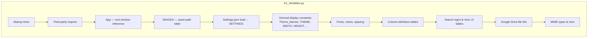

# A1 Variables — Flow

**About:** [description](../__about/A1_Variables.md)

## Structure

Config file — the tree below shows its sections, not an algorithm (this
module has almost no logic of its own beyond loading `Settings.json` and
deriving a handful of theme-conditional constants).



## Column-definition tables (the widest section)

```
MainTablePacijenti  — patient list: ID, id_pacijent, Ime, Prezime, Starost,
                       Godište, Pol, 3× Datum (Prijem/Operacija/Otpust),
                       6× diagnosis fields, 6× staff-role fields
SlikeTable           — images: ID, id_slike, id_pacijent, Naziv, Opis,
                        Format, Veličina, width, height, pixels, image_data
MKBTable              — MKB-10 catalog: ID, id_dijagnoza, MKB šifra, Opis
ZaposleniTable        — staff: ID, id_zaposleni, Zaposleni
LogsTable             — audit log: ID, ID Time, Email, Query, Error
SessionTable          — sessions: ID, Email, Logged IN, Logged OUT, Session
```

Each table entry is `{'checkbutton': ..., 'group': ..., 'table': header
text, 'column_width': ..., 'column_anchor': ...}` (Patients table) or the
simpler `{'table': ..., 'column_width': ..., 'column_anchor': ...}` (the
other five) — these drive every Treeview's column setup directly, and the
Patients table's `checkbutton`/`group` fields additionally drive the
column-visibility checkbuttons built by `MainPanel.Checkbutton_Create` (see
[D3 Main Panel](../__about/D3_MainPanel.md)).

## Load-order dependency (why this file cannot be reordered casually)

```
import time → TIME_START            (must be FIRST — measures app boot time)
    ↓
third-party imports                 (ttkbootstrap, torch, easyocr, ...)
    ↓
Settings.json read → SETTINGS       (file I/O — can fail if the file is
                                      missing/corrupt; no try/except today)
    ↓
THEME, F_SIZE, WIDTH, ... derived from SETTINGS
    ↓
every table below uses F_SIZE for column widths
    ↓
GD_* / *_dict Google Drive IDs — independent of SETTINGS
```

A `Settings.json` change is only picked up on the next full app restart —
`SETTINGS`/`THEME`/`F_SIZE`/etc. are all snapshotted once at import time,
not re-read.
