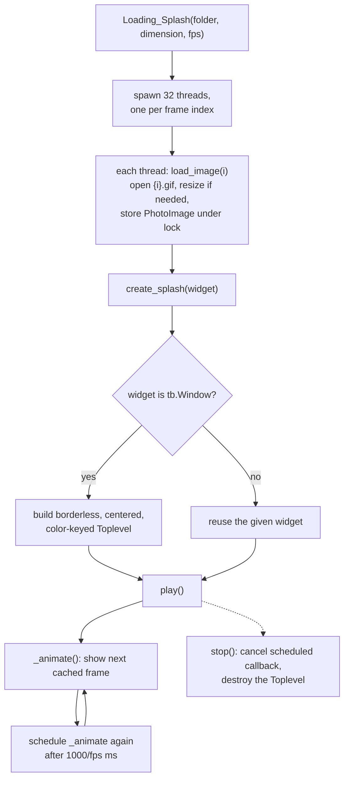

# A3 Load Splash — Flow

**About:** [description](../__about/A3_LoadSplash.md)

## Algorithm

Pseudocode:

    ON Loading_Splash(folder, dimension, fps):
        FOR i IN 0..31:
            START thread load_image(i)   # parallel frame preload, no join

    FUNCTION load_image(i):
        image = open(folder / f"{i}.gif")
        IF dimension != 850: resize(image)
        LOCK: images[i] = PhotoImage(image)

    ON create_splash(widget):
        IF a splash Toplevel already exists: return
        BUILD a borderless Toplevel centered on screen (or reuse `widget`)
        play()

    ON play():
        IF not already playing:
            is_playing = True
            _animate()

    FUNCTION _animate():
        IF is_playing:
            show next frame from the cycling image list
            RESCHEDULE _animate() after (1000 // fps) ms

    ON stop():
        cancel the scheduled _animate callback
        destroy the Toplevel

Because the 32 preload threads are fire-and-forget (no `join()`), the first
few animation frames can legitimately still be `None` if `_animate()` runs
before every thread finishes — `cycle()` will hand back whatever is in
`self.images` at that moment. This file is not currently used by the app
(see [about](../__about/A3_LoadSplash.md)); the flow is documented because
its logic is genuinely non-trivial and the near-identical class in
[B3 Media](../__about/B3_Media.md) IS live.
