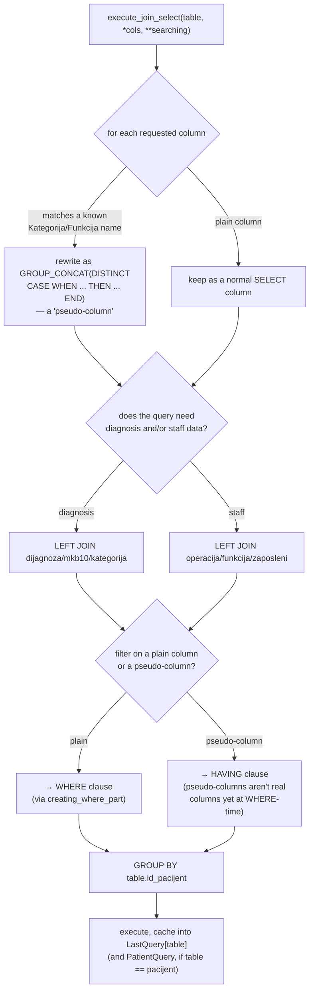

# B2 SQLite — Flow

**About:** [description](../__about/B2_SQLite.md)

## Algorithm — `execute_join_select` (the core read-path query builder)

Pseudocode:

    FUNCTION execute_join_select(table, *columns, **searching):
        select_parts = []
        FOR col IN columns:
            IF col is a known Kategorija/Funkcija name:
                select_parts.append(GROUP_CONCAT(DISTINCT CASE WHEN category=col THEN value END))
                mark col as a "pseudo-column"
            ELSE:
                select_parts.append(col)

        joins = []
        IF any requested column or filter touches diagnosis data:
            joins.append("LEFT JOIN dijagnoza/mkb10/kategorija")
        IF any requested column or filter touches staff data:
            joins.append("LEFT JOIN operacija/funkcija/zaposleni")

        where_parts, having_parts = [], []
        FOR column, values IN searching.items():
            fragment = creating_where_part(column, values)
            IF column is a pseudo-column: having_parts.append(fragment)
            ELSE: where_parts.append(fragment)

        query = SELECT select_parts FROM table
                + joins
                + (WHERE where_parts IF where_parts)
                + f"GROUP BY {table}.id_pacijent"
                + (HAVING having_parts IF having_parts)

        run query; cache it into LastQuery[table] (and PatientQuery if table == 'pacijent')
        RETURN rows

`get_patient_data(ID)` runs the same JOIN/GROUP_CONCAT/CASE pattern as a
single-patient variant (plus a synthetic `Slike` column concatenating
image metadata, split back into a Python list). `creating_where_part`
dispatches per comparator: `EQUAL` → IN-list or `=`; `LIKE`/`NOT LIKE` →
OR'd/AND'd wildcard; `BETWEEN` → OR'd ranges; `GREATER`/`LESS` → a single
bound.
