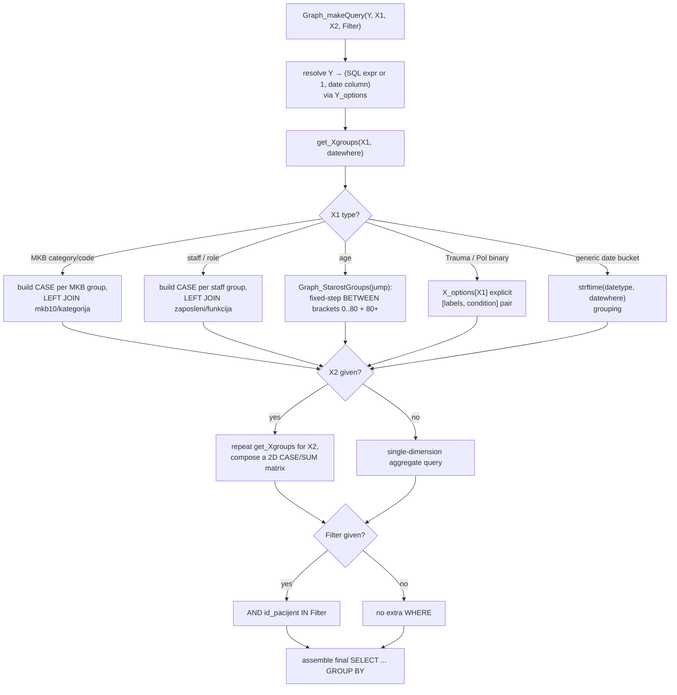

# B4 Graph — Flow

**About:** [description](../__about/B4_Graph.md)

## Algorithm — `Graph_makeQuery` / `get_Xgroups`

Pseudocode:

    FUNCTION Graph_makeQuery(Y, X1, X2, Filter):
        y_expr, date_col = Y_options[Y]

        FUNCTION get_Xgroups(X, datewhere):
            IF X is an MKB category or an individual MKB code:
                RETURN (CASE-per-MKB-group conditions, extra WHERE, "mkb10/kategorija")
            IF X is a staff member or a staff role:
                RETURN (CASE-per-staff conditions, extra WHERE, "zaposleni/funkcija")
            IF X == "Starost" (age):
                RETURN (Graph_StarostGroups(jump), None, None)
            IF X IN X_options AND X_options[X] is a [labels, condition] pair:
                RETURN (that pair, None, None)
            ELSE:  # generic date dimension (Year/Month/Weekday/Day)
                RETURN (strftime(DateTypes[X], datewhere) buckets, None, None)

        x1_groups, extra_where_1, join_1 = get_Xgroups(X1, date_col)
        IF X2: x1_groups, extra_where_2, join_2 = get_Xgroups(X2, date_col)  # 2D matrix

        query = SELECT (CASE-conditioned SUM/AVG of y_expr per group) ...
                FROM pacijent
                + conditional JOINs (join_1, join_2)
                + WHERE (extra_where_1 AND extra_where_2 AND id_pacijent IN Filter, if any)
        RETURN query

This is the **third** occurrence of the `dijagnoza/mkb10/kategorija` and
`operacija/funkcija/zaposleni` LEFT JOIN pattern in the codebase — the same
shape appears (twice) in [B2 SQLite](../__about/B2_SQLite.md)'s
`execute_join_select`/`get_patient_data`. A future rework should centralize
this JOIN template once.
