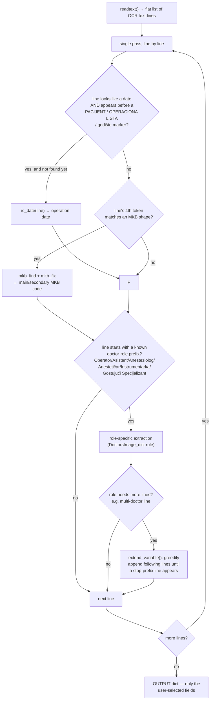

# B5 AI — Flow

**About:** [description](../__about/B5_AI.md)

## Algorithm — `Operaciona_LineReader` (the OCR post-processing pass)

Pseudocode:

    FUNCTION Operaciona_LineReader(result):
        OUTPUT = {}
        FOR i, line IN enumerate(result):
            IF operation date not yet found AND line looks like a date
               AND we are still before a "PACIJENT"/"OPERACIONA LISTA"/"godište" marker:
                OUTPUT['Datum Operacije'] = is_date(line)

            IF the field is selected AND line's 4th whitespace token looks like an MKB code:
                code, offset = mkb_find(result, line, i)      # may look at i±1 on IndexError
                OUTPUT[<matching diagnosis field>] = mkb_fix(code)

            FOR role, prefixes IN DoctorsImage_dict.items():
                IF the selected field for `role` is on AND line starts with one of `prefixes`:
                    name = extract name from this line (role-specific parsing;
                           Asistent additionally filters "still in training" lines;
                           Gostujući Specijalizant parses multiple "Dr X Y" names
                           from one line)
                    IF the name looks incomplete:
                        name = extend_variable(i, name, prefixes, result)  # append next lines
                    OUTPUT[role] = name
        RETURN OUTPUT

`mkb_fix` normalizes OCR misreads of the leading MKB/ICD-10 letter:
digit `5`/`8` → `S`, `2` → `Z`, `0` → `D`, anything else → `X`; `O` → `0`,
`?` → `1`; strips stray `,`/`.`; reinserts a period before the last digit
for 4-character codes. `Operacion_ParagraphReader` (the paragraph-mode
counterpart) is an unimplemented stub — see
[about](../__about/B5_AI.md).
