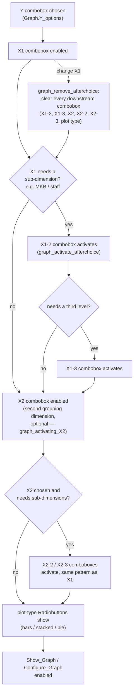
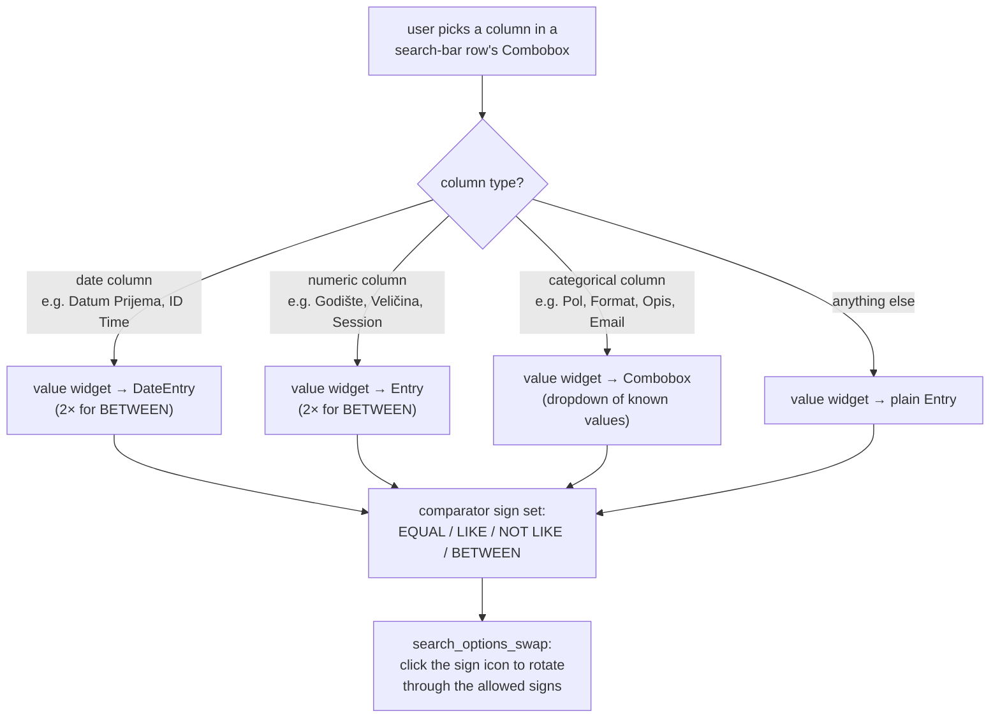

# C3 Select DB — Flow

**About:** [description](../__about/C3_SelectDB.md)

This file is 1,257 lines covering ~12 distinct features (full breakdown in
the about doc's responsibility table). The two pieces below are the ones a
diagram genuinely explains better than the code: the Graph-tab wizard
(`graph_choice_analyze`) and the search-bar's per-column-type widget
morphing (`search_options`). Everything else in the file is Standard-grade
CRUD/display glue, documented in prose in the about doc.

## Algorithm 1 — `graph_choice_analyze` (Graph-tab cascading wizard)

Pseudocode:

    ON Y changed:
        enable X1 combobox with options relevant to the chosen Y

    ON X1 changed:
        graph_remove_afterchoice()   # clear every downstream combobox first
        IF X1's type needs a sub-dimension (e.g. "MKB category" needs which category):
            activate X1-2 (and, if that also branches, X1-3)
        enable X2 (the optional second grouping axis), same cascade rules

    ON X2 changed:  # same cascade as X1, one level deeper
        graph_remove_afterchoice() for X2's downstream only
        IF X2's type needs a sub-dimension:
            activate X2-2 (and X2-3)

    WHEN the full Y/X1[.../X2...] chain is resolved:
        show the plot-type Radiobuttons (bars / stacked bar / pie)
        enable "Show Graph" / "Configure Graph"

The fixed axis-name sequence driving this cascade is
`['Y','X1-1','X1-2','X1-3','X2-1','X2-2','X2-3']` — index-based list
slicing against this sequence is how `graph_choice_analyze` knows which
comboboxes are "downstream" of a given change.

## Algorithm 2 — `search_options` (search-bar column-type widget morphing)

Pseudocode:

    ON column selected in a search-bar row:
        IF column IN date-type list: build a DateEntry (or 2, for BETWEEN)
        ELIF column IN numeric-type list: build an Entry (or 2, for BETWEEN)
        ELIF column IN categorical list: build a Combobox of known values
        ELSE: build a plain Entry
        set the row's allowed comparator signs for this column's type

    ON comparator sign icon clicked:
        rotate to the next sign in the allowed set (search_options_swap)
