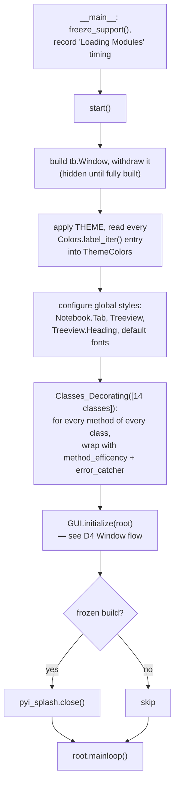

# E Start — Flow

**About:** [description](../__about/E_Start.md)

## Algorithm — application boot sequence

Pseudocode:

    ON __main__:
        multiprocessing.freeze_support()
        UserSession['GUI']['Loading Modules'] = elapsed time since TIME_START
        start()

    FUNCTION start():
        root = build tb.Window (hidden)
        style = apply THEME
        FOR each theme color label: ThemeColors[label] = style.colors.get(label)
        configure Notebook / Treeview / font styles globally

        FUNCTION Classes_Decorating(class_list):
            FOR each CLASS in class_list:
                FOR each method defined on CLASS:
                    replace it with method_efficency()(error_catcher()(method))

        Classes_Decorating([GoogleDrive, Database, Media, Graph, AI,
                             Controller, GodMode, ManageDB, SelectDB,
                             TopPanel, FormPanel, MainPanel, GUI])

        GUI.initialize(root)          # builds and shows the whole UI
        IF running as a frozen EXE: close the PyInstaller splash screen
        root.mainloop()

`Classes_Decorating` is the single mechanism that gives every method of
these 14 classes both perf telemetry (`method_efficency`) and audit-logged
error visibility (`error_catcher`) — see
[A2 Decorators](../__about/A2_Decorators.md). Any class NOT in this list
(e.g. `Loading_Splash`) gets neither, automatically.
