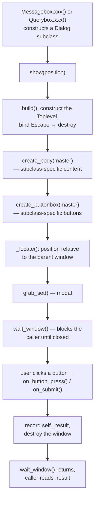
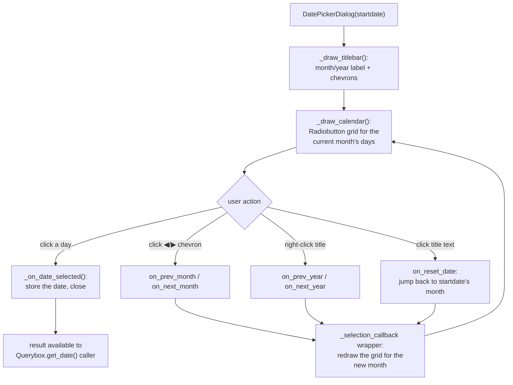

# dialogs — Flow

**About:** [description](../__about/dialogs.md)

## Algorithm 1 — `Dialog` template-method lifecycle

Pseudocode:

    ON Messagebox.show_xxx() / Querybox.get_xxx():
        dialog = MessageDialog(...) or QueryDialog(...)
        dialog.show(position)

    METHOD Dialog.show(position):
        build()                      # constructs Toplevel, binds Escape
        create_body(master)          # subclass fills in its content
        create_buttonbox(master)     # subclass fills in its buttons
        _locate(position)            # position relative to parent
        grab_set()                   # make modal
        wait_window()                # BLOCKS here until destroyed

    ON a button pressed (MessageDialog) / Submit pressed (QueryDialog):
        IF QueryDialog: validate() the entry value first; on failure, show
           an error Messagebox and do NOT close
        result = the chosen value / button label
        destroy the window            # wait_window() in show() now returns

    CALLER (after show() returns): read dialog.result

## Algorithm 2 — `DatePickerDialog` calendar navigation

Pseudocode:

    ON DatePickerDialog(startdate):
        build own Toplevel (does NOT reuse the Dialog base class)
        draw titlebar (month/year, prev/next chevrons)
        draw the current month's day grid as Radiobuttons
        grab_set(); wait_window()

    DECORATOR _selection_callback(nav_function):
        # wraps every prev/next/reset handler
        RUN nav_function()            # changes the displayed month/year
        redraw the day grid for the new month

    ON a day Radiobutton clicked:
        store the clicked date as the result
        destroy the window            # wait_window() returns

`FontDialog` follows the same `Dialog`-subclass template as
`MessageDialog`/`QueryDialog` (Algorithm 1) with a 4-panel body (family
list, size list, weight/slant/effects, live preview) — no separate diagram
needed; see [about](../__about/dialogs.md) for its method list.
