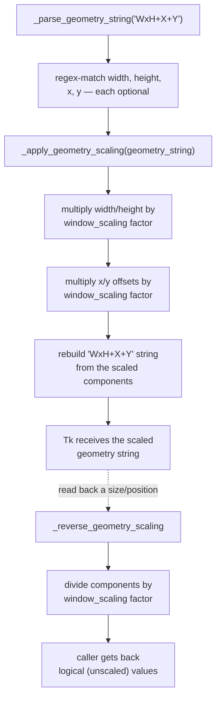

# scaling_base_class — Flow

**About:** [description](../__about/scaling_base_class.md)

## Algorithm — geometry-string scaling round-trip

Pseudocode:

    FUNCTION _parse_geometry_string(s):
        # Tk geometry strings are "WxH+X+Y", each part optional
        MATCH s against a regex capturing width, height, x, y
        RETURN (width, height, x, y) — None for any part not present

    FUNCTION _apply_geometry_scaling(geometry_string):
        width, height, x, y = _parse_geometry_string(geometry_string)
        RETURN rebuild "WxH+X+Y" with each present component
               multiplied by self._get_window_scaling()

    FUNCTION _reverse_geometry_scaling(scaled_geometry_string):
        width, height, x, y = _parse_geometry_string(scaled_geometry_string)
        RETURN rebuild "WxH+X+Y" with each present component
               divided by self._get_window_scaling()

The same apply/reverse pattern repeats for widget sizes
(`_apply_widget_scaling`/`_reverse_widget_scaling`), fonts
(`_apply_font_scaling`), and layout kwargs
(`_apply_argument_scaling`) — all driven by the same two live scale
factors (`widget_scaling`, `window_scaling`) that `ScalingTracker` pushes
via `_set_scaling()` callbacks whenever the OS DPI or the app's own scale
setting changes. This file cannot actually run in this project (its
relative imports are unresolvable — see
[about](../__about/scaling_base_class.md)); the flow is documented on the
class's own merits since it is a real, non-trivial algorithm.
