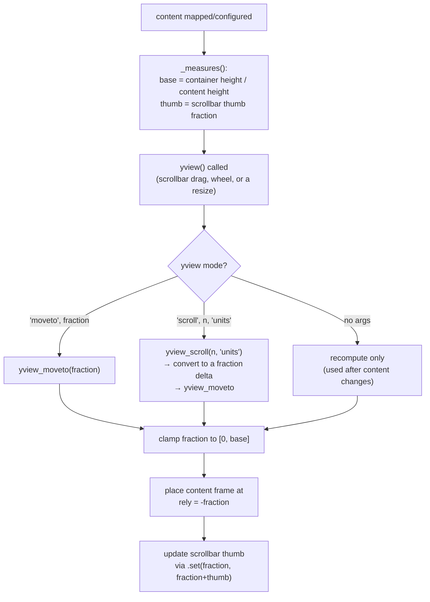

# scrolled — Flow

**About:** [description](../__about/scrolled.md)

## Algorithm — `ScrolledFrame`'s scroll-position math

Pseudocode:

    FUNCTION _measures():
        base = container_height / content_height     # 1.0 if content fits entirely
        thumb = base                                    # thumb size as a fraction of the track
        RETURN base, thumb

    FUNCTION yview_moveto(fraction):
        base, thumb = _measures()
        fraction = clamp(fraction, 0, max(0, 1 - thumb))
        content_frame.place(rely = -fraction * content_height / container_height)
        scrollbar.set(fraction, fraction + thumb)

    FUNCTION yview_scroll(number, what):
        # convert wheel/click "units" into a fraction delta, then reuse yview_moveto
        delta = number * one_unit_as_fraction
        yview_moveto(current_fraction + delta)

    ON mouse wheel event:
        delta = platform-specific:
            Windows: event.delta / 120
            macOS (aqua): event.delta
            Linux (X11): fixed ±10 via Button-4/Button-5
        yview_scroll(-delta, "units")

    ON any descendant widget added/removed:
        _add_scroll_binding(parent) / _del_scroll_binding(parent)
            recursively bind/unbind the mouse-wheel handler on every
            child so scrolling works no matter which nested widget has
            focus

Not currently used by the app (the real `ScrolledFrame`/`ScrolledText` come
from the installed `ttkbootstrap` package — see
[about](../__about/scrolled.md)); documented on its own algorithmic merit.
