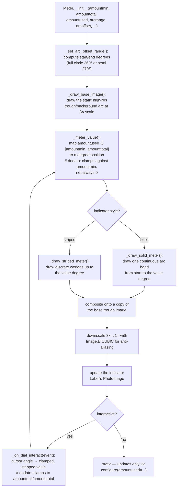

# widgets — Flow

**About:** [description](../__about/widgets.md)

## Algorithm — `Meter`'s draw pipeline (the file's most complex logic)

Pseudocode:

    ON Meter created (or amountused/amounttotal/amountmin changed):
        compute arc start/end degrees from arcrange/arcoffset/meter type
        draw the static trough/background arc once, at 3× supersampling

        FUNCTION _meter_value():
            # dodato: the local patch — upstream always assumed min=0
            fraction = (amountused - amountmin) / (amounttotal - amountmin)
            RETURN start_degree + fraction * arc_span_degrees

        value_degree = _meter_value()
        IF style == "solid":
            draw one continuous colored arc from start_degree to value_degree
        ELSE:  # striped
            draw discrete wedges up to value_degree

        composite the colored arc onto a copy of the base trough image
        downscale 3× → 1× (BICUBIC) for a smooth edge
        update the indicator Label's image

    ON mouse drag (if interactive=True):
        angle = angle of the cursor relative to the meter's center
        raw_value = map angle back to an amount, using the same
                    amountmin/amounttotal range as _meter_value()
        # dodato: clamp raw_value into [amountmin, amounttotal]
        IF raw_value <= amountmin: amountused = amountmin
        ELIF raw_value >= amounttotal: amountused = amounttotal
        ELSE: amountused = raw_value
        redraw (loop back to the top)

`DateEntry` and `Floodgauge` are comparatively simple keyword-wiring widgets
— no diagram needed for them; see [about](../__about/widgets.md) for their
method lists.
